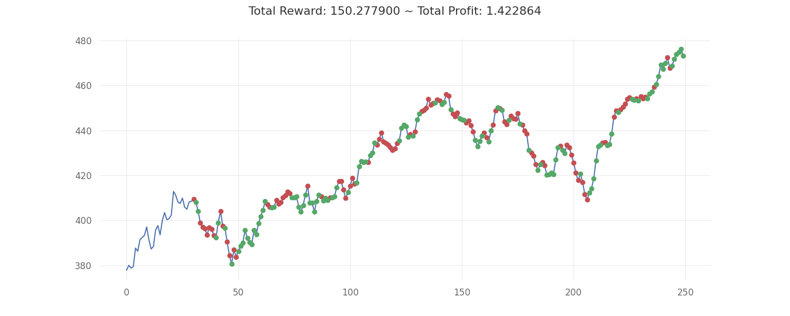
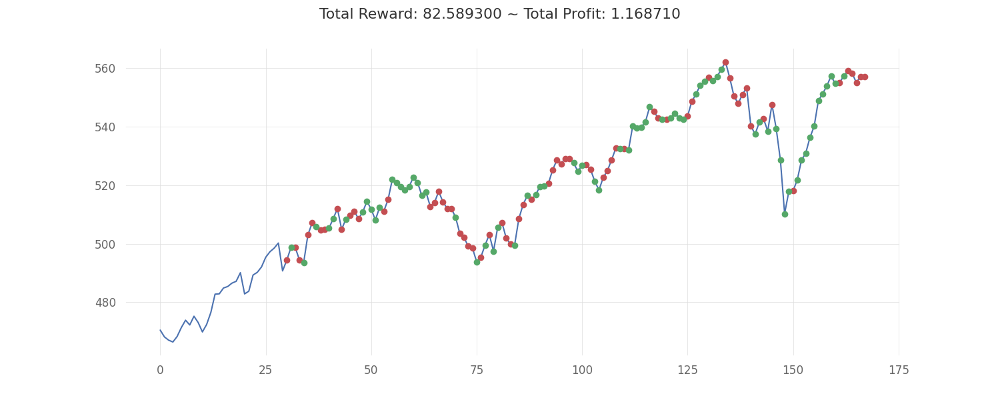
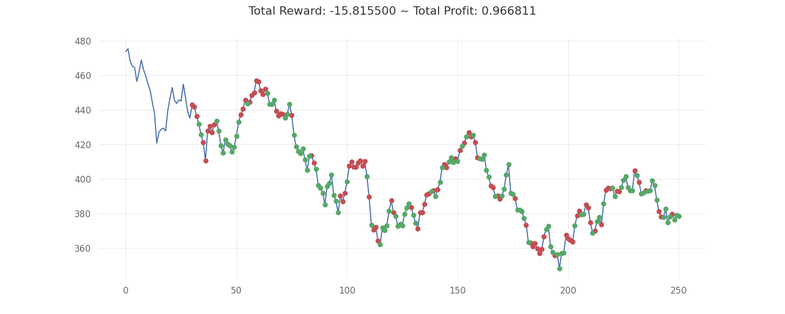

# ML-based Trading bot

## Trading algorithms:

- PPO

## Deployment

- CI/CD using GitHub Action on a self-host runner with RTX 1080Ti

## Performance

- Lookback window size
- Indicators
- Training data period
- Trading intervals

### Train on SPY data with 30 days lookback window
|  | Buy&Hold     | Max possible     | RL optimized     | Profit increase|
|--------------|--------------|--------------|--------------|--------------|
| **Train** (2023-01-01 to 2023-12-31)| 1.16| 1.99| 1.42|  **22%**|
| **Test1** (2024-01-01 to 2024-09-01) | 1.11| 1.59| 1.17| **5%**|
| **Test2** (2022-01-01 to 2022-12-31) | 0.86| 2.99| 0.92| **7%**|

    
    
    

